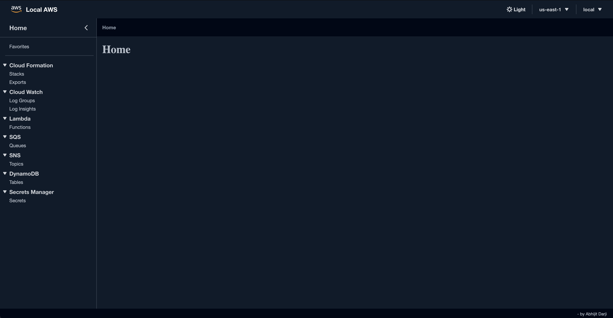
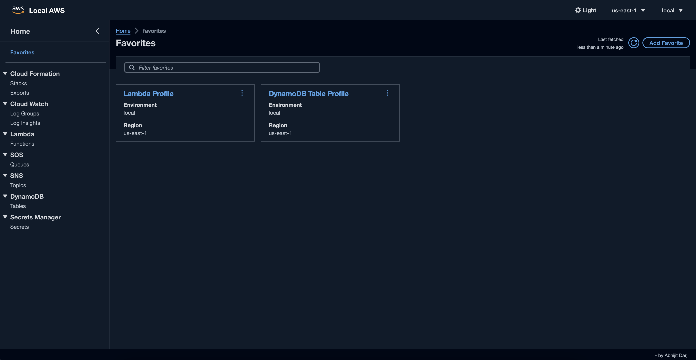

# Local AWS Console

A local AWS console that can be used to interact with AWS services across multiple AWS profiles and regions based on the AWS CLI configuration.



## Features

### AWS Services

- CloudFormation Stacks, Exports
- CloudWatch Logs, Log Insights
- DynamoDB
- ECR (Private & Public)
- Lambda
- S3
- Secrets Manager
- SNS
- SQS

### Application Features

- Multiple AWS profiles (including SSO profiles)
- Multiple AWS regions
- Dark mode
- Favorites for services across profiles
- CloudWatch Logs Insights saved queries and query history
- JSON file database for storing favorites and saved queries
- Server-side caching with tag-based invalidation
- Streaming Server Components with React 19 `use()`



## Built With

- [Next.js 16 (App Router)](https://nextjs.org/) — Server Components, `'use cache'`, Server Actions
- [React 19](https://react.dev/)
- [TypeScript 6](https://www.typescriptlang.org/)
- [Cloudscape Design System](https://cloudscape.design/) — AWS-style UI components
- [AWS SDK for JavaScript v3](https://docs.aws.amazon.com/sdk-for-javascript/v3/developer-guide/welcome.html)
- [Zustand](https://zustand-demo.pmnd.rs/) — client state with cookie persistence
- [Zod 4](https://zod.dev/) — runtime validation
- [Pino](https://getpino.io/) — structured server-side logging
- [Biome 2](https://biomejs.dev/) — linting and formatting

## Getting Started

### Prerequisites

- [Node.js](https://nodejs.org/) >= 22 (for local development)
- [Docker](https://docs.docker.com/get-docker/) and [Docker Compose](https://docs.docker.com/compose/install/) (for containerized usage)
- [AWS CLI](https://docs.aws.amazon.com/cli/latest/userguide/cli-chap-install.html) with profiles configured in `~/.aws/config` and `~/.aws/credentials`
- (Optional) [LocalStack](https://www.localstack.cloud/) for local AWS emulation

### Installation

#### Option 1 — Docker Compose (recommended)

1. Mount the AWS configuration directory and a local `config` directory into the container.
2. The `config` directory must contain a `default.json` file listing the enabled regions:

```json
{
  "ENABLED_REGIONS": [
    {
      "name": "US East (N. Virginia)",
      "code": "us-east-1"
    },
    {
      "name": "US East (Ohio)",
      "code": "us-east-2"
    }
  ]
}
```

3. Create `config/db.json` (used to persist favorites and saved queries):

```json
{ "favorites": [], "savedQueries": [] }
```

4. Use the included `docker-compose.yml`:

```yaml
services:
  app:
    build: .
    image: local-aws-console:latest
    container_name: local-aws-console
    ports:
      - '3000:3000'
    volumes:
      - $HOME/.aws:/root/.aws
      - ./config:/app/config
    extra_hosts:
      # Makes host.docker.internal resolve to the Docker host on Linux too
      - 'host.docker.internal:host-gateway'
    environment:
      - NODE_ENV=production
      - PORT=3000
      - HOSTNAME=0.0.0.0
      # Rewrites localhost/127.0.0.1 in any LocalStack endpoint URL so the
      # container can reach LocalStack running on the host machine.
      - LOCALSTACK_HOST=host.docker.internal
```

5. Start the container:

```bash
docker compose up -d
```

#### Option 2 — Local development

```bash
git clone git@github.com:abhijitdarji/local-aws-console.git
cd local-aws-console
npm install
npm run dev
```

The dev server runs on `http://localhost:3000` with Turbopack.

### Scripts

| Script | Description |
|--------|-------------|
| `npm run dev` | Start Next.js dev server (Turbopack) |
| `npm run build` | Build for production |
| `npm run start` | Start the production server |
| `npm run lint` | Run Biome linter |
| `npm run format` | Format code with Biome |
| `npm run check` | Run Biome lint + format checks |
| `npm run check:fix` | Auto-fix Biome issues |

## Usage

1. Open `http://localhost:3000` in your browser.
2. Select the AWS profile (environment) and region from the top navigation bar.
3. Click any service from the left menu or the home page to start exploring resources.
4. Use the favorites star to bookmark frequently used resources across profiles.

## Architecture

This app uses the Next.js App Router with a strict Server/Client component split:

- **Server Components** (`app/<service>/page.tsx`) fetch AWS data using `'use cache'` functions in `app/lib/server/aws/*.ts`.
- **Client Components** (`*-detail.tsx`, `app/components/*`) handle interactivity and use Cloudscape components.
- **Server Actions** (`'use server'`) invalidate cached AWS responses via tag-based `revalidateTag()`.
- **AWS SDK clients** are pooled with an LRU cache (`app/lib/server/aws-client-manager.ts`).

See [`AGENTS.md`](./AGENTS.md) for the full architecture, conventions, and contribution guidelines.
